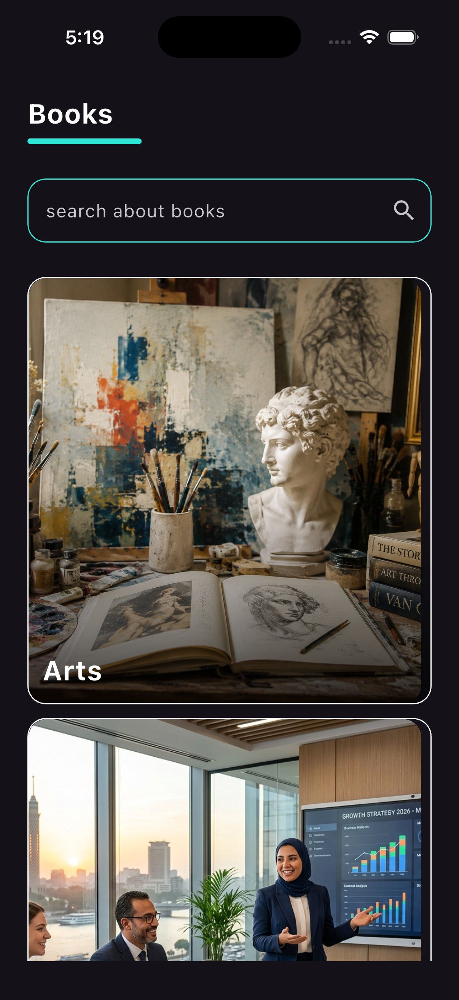
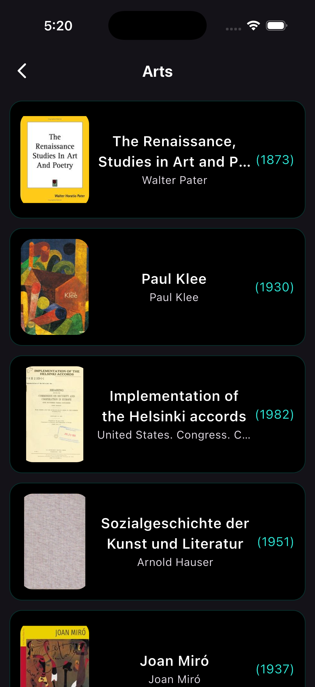

# Books App  
Flutter project  

## Overview  
Application for displaying books and categories  
Data from API and assets  
Navigation between screens  

## Features  
Browse book categories  
Show book list  
Show book details  
Load images from cache  
API integration  

## Screenshots  

### First screen  
  

### Second screen  
  

## Setup  

Clone repository  
Open project folder  
Run flutter pub get  
Run flutter run  

## Structure  

lib folder contains application code  
core folder contains shared code  
features folder contains modules  
assets folder contains images  

## Notes  

Add images inside assets folder  
Commit assets before push  
Check file names match exactly in repository  